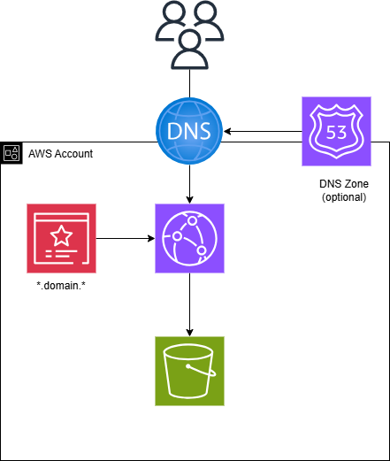

# Terraform Stack foir Static Sites
Terraform Stack for create a Static Site using AWS Resources





# Static site Terraform stack

Terraform stack that provisions a static website on AWS using **S3 + CloudFront + ACM**, with a private origin bucket and an edge-cached, HTTPS-only distribution.


## Architecture

- **S3 bucket** — stores the static site files. Public access is fully blocked; the bucket is only readable by CloudFront.
- **CloudFront distribution** — serves the site over HTTPS, using an **Origin Access Control (OAC)** to reach the S3 bucket, so the origin never needs to be public.
- **ACM certificate** — issued in `us-east-1` (required for CloudFront), DNS-validated, covering the apex domain and the `www` subdomain.
- **Remote state** — Terraform state is stored in a separate S3 backend bucket (`eu-south-1`), with encryption enabled.

Everything is provisioned in a single default cache behavior: `GET`/`HEAD` only, compression enabled, no cookies/query string forwarding, and a `403 → /index.html` rewrite so client-side routing keeps working on refresh.

## Prerequisites

- Terraform >= 1.5.0
- An AWS account with permissions to manage S3, CloudFront, and ACM
- A registered domain (DNS is managed **outside** this stack — point your domain's DNS to the CloudFront distribution after apply)

## Usage

```bash
terraform init
terraform plan -var-file="variables/variables.tfvars"
terraform apply -var-file="variables/variables.tfvars"
```

### Required variables

| Variable      | Description                          | Default      |
|---------------|---------------------------------------|--------------|
| `project`     | Project name, used to prefix resources | —            |
| `domain_name` | Apex domain for the site               | —            |
| `region`      | AWS region for the S3 bucket           | `eu-south-1` |
| `aws_profile` | Named AWS CLI profile to use           | `null`       |

After `apply`, point your domain's DNS to the CloudFront distribution domain name (see the `cloudfront_domain` output). Certificate DNS validation records also need to be created with your DNS provider before the ACM certificate can validate.

## Outputs

- `bucket_name` — name of the S3 bucket hosting the site
- `cloudfront_domain` — CloudFront distribution domain (e.g. `d123456abcdef.cloudfront.net`)

## Project structure

```
.
├── main.tf          # providers, locals
├── providers.tf      # required providers + S3 backend config
├── variables.tf      # input variables
├── output.tf          # outputs
├── tf-01-s3.tf         # S3 bucket + public access block
├── tf-02-acm.tf         # ACM certificate + validation
├── tf-03-cdn.tf          # CloudFront distribution + OAC + bucket policy
└── tf-04-dns.tf           # (optional) Route53 records, disabled by default
```

## License

GPL-3.0
